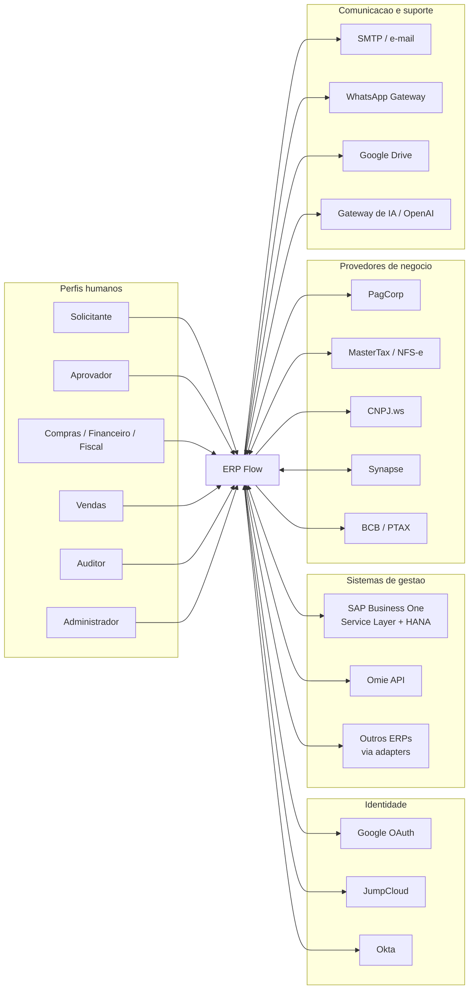
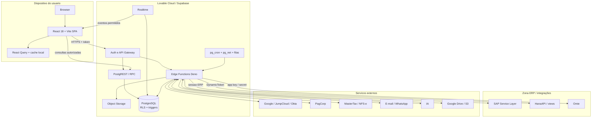
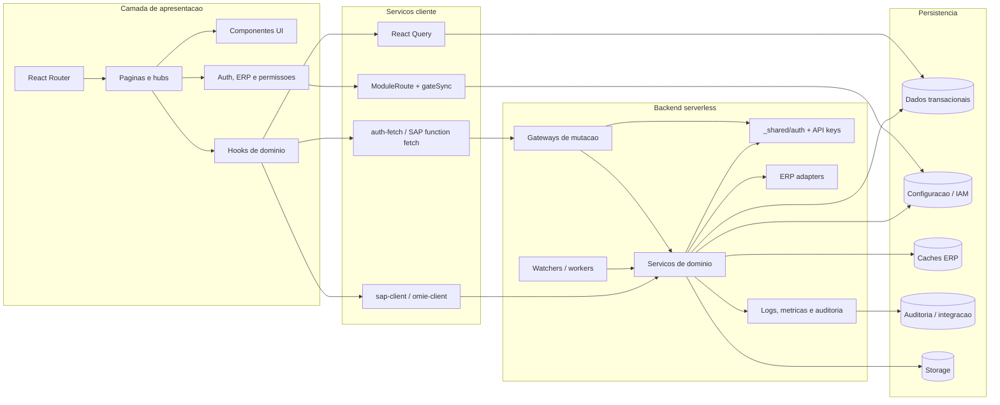
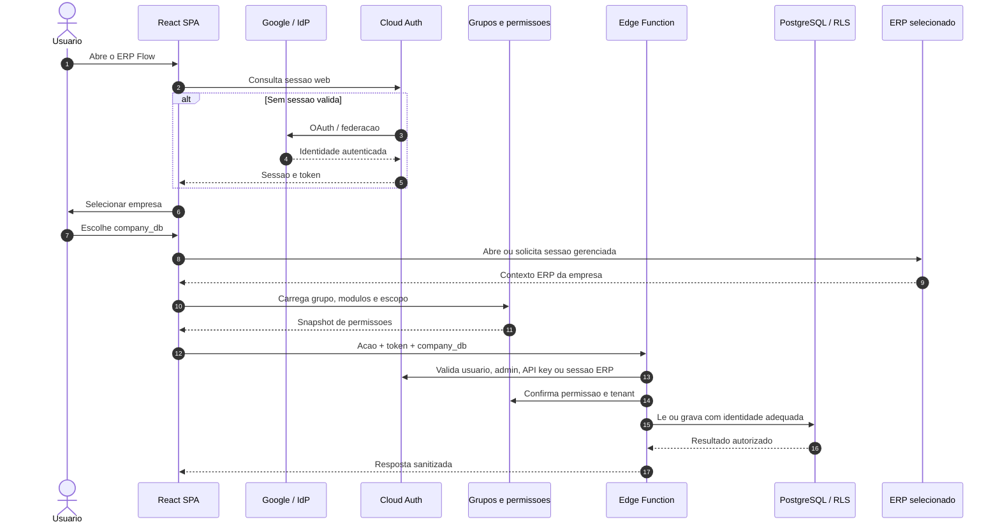
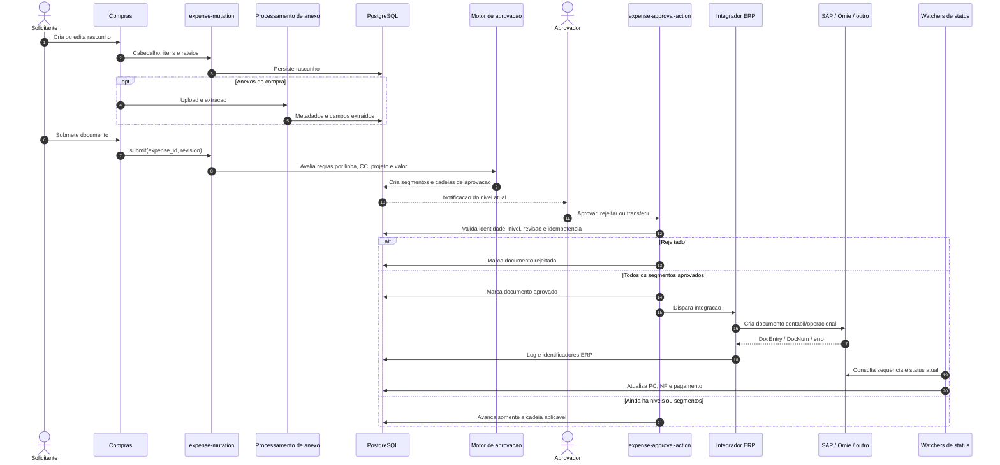
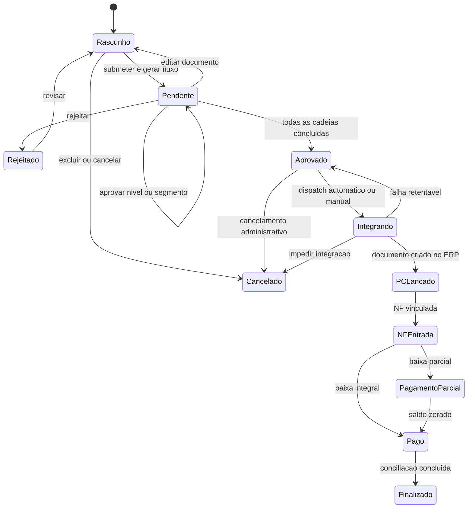
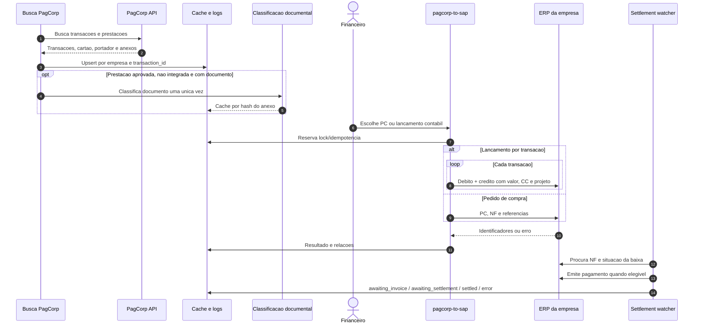
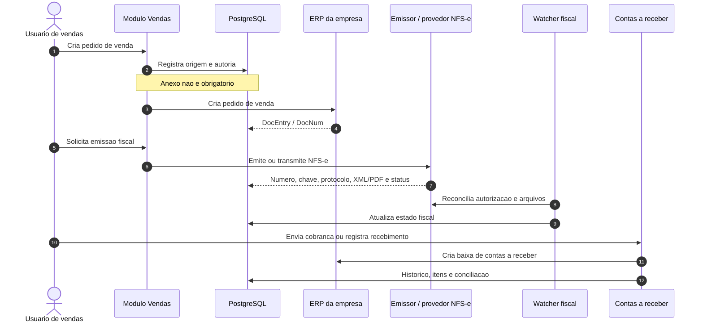
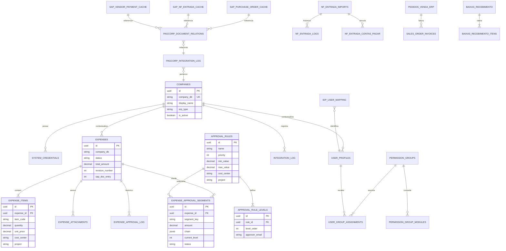
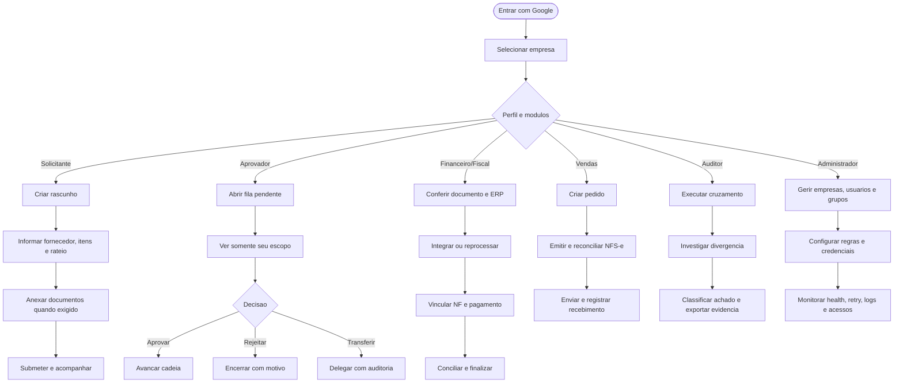

# ERP Flow - Arquitetura, UML e Jornadas

> Documento arquitetural do estado observado no repositorio em 31/08/2026.
> Os diagramas usam Mermaid para permanecerem versionaveis junto ao codigo.

## 1. Escopo e leitura

O ERP Flow e uma plataforma web multiempresa que coordena processos financeiros
e administrativos entre usuarios, regras internas e ERPs externos. A aplicacao
nao substitui o ERP contabil: ela organiza solicitacoes, aprovacoes, documentos,
auditoria e integracoes, mantendo o ERP da empresa como destino ou fonte
operacional.

Esta documentacao cobre:

- arquitetura externa: usuarios, IdPs, ERPs e demais provedores;
- arquitetura interna: frontend, Edge Functions, banco, storage, filas e jobs;
- limites de confianca, autenticacao e autorizacao;
- dominios e regras de negocio;
- fluxos de dados e estados dos documentos;
- jornadas de usuarios e agentes de sistema.

### Convencoes

| Marcador | Significado |
|---|---|
| `company_db` | Tenant logico e empresa selecionada |
| ERP | SAP Business One, Omie ou outro adapter habilitado |
| Edge Function | Backend serverless Deno/Supabase |
| Service role | Identidade tecnica privilegiada, somente no backend |
| RLS | Row Level Security do PostgreSQL |
| Watcher | Processo periodico idempotente de sincronizacao |

## 2. Visao de contexto - arquitetura externa

## 3. Visao de implantacao

### Limites de confianca

1. O browser e nao confiavel: controles visuais nao substituem validacao no backend.
2. Edge Functions formam a fronteira transacional e validam identidade, tenant,
   permissao, idempotencia e estado antes de usar `service_role`.
3. RLS protege acessos diretos via PostgREST; integracoes privilegiadas passam
   pelo backend.
4. Credenciais de ERP e provedores ficam em `system_credentials` ou secrets do
   runtime, nunca no payload devolvido ao frontend.
5. Toda chamada a ERP deve carregar o contexto da empresa e usar locks,
   idempotencia e log de integracao.

## 4. Arquitetura interna por componentes

### Modulos funcionais

| Contexto | Responsabilidade | Backend principal | Dados centrais |
|---|---|---|---|
| Compras e despesas | Rascunho, itens, anexos, aprovacao e envio ao ERP | `expense-*` | `expenses`, `expense_items`, `expense_attachments` |
| Aprovacoes | Regras, niveis, segmentos, substitutos e decisoes | `approvals-feed`, `expense-approval-action` | `approval_rules`, `expense_approval_segments`, logs |
| Vendas | Pedidos, NFS-e, adiantamentos e recebimentos | `sales-*`, `baixa-recebimento` | `pedidos_venda_erp`, `sales_order_invoices`, `baixas_recebimento` |
| PagCorp | Transacoes, prestacoes, IA, lancamento e baixa | `pagcorp-*` | mapeamentos, logs, relacoes e cache de IA |
| Fiscal | NF de entrada, arquivos, matching e fila ERP | `mastertax-*`, `nf-entrada-*` | `nf_entrada_imports`, logs e contas a pagar |
| Auditoria | Cruzamentos, divergencias, KYP e trilhas | `audit-*`, `kyp-orchestrator` | `audit_console_*`, `audit_pay_*` |
| IAM | Perfis, grupos, IdP, licencas e revisao de acesso | `admin-users`, `idp-*`, `okta-*`, `jumpcloud-*` | usuarios, grupos, mappings e roles |
| Integracoes | Credenciais, monitor, retry, health e kill-switch | workers e proxies | `system_credentials`, `integration_log`, `integration_pause` |
| Cadastros | Fornecedores, itens e replicacao intercompany | `fornecedor-save`, `item-save`, `intercompany` | `fornecedores`, `item_base`, `item_variante` |

## 5. Autenticacao e autorizacao

### Camadas de autorizacao

| Camada | Funcao |
|---|---|
| `RequireAuth` | Exige sessao web, exceto login e link assinado de aprovacao |
| `ModuleRoute` | Gate de UX por modulo |
| `AdminRoute` | Restringe backoffice a `admin` |
| `PermissionsV2` | Shadow/enforcement, feature flag, kill-switch e telemetria |
| Edge Function | Autoridade final para acao, empresa, documento e transicao |
| RLS | Restringe linhas em acessos diretos ao banco |
| API key | Escopo por servico, empresa/projeto, validade e revogacao |
| Link assinado | Token de uso controlado, expiracao e decisao idempotente |

## 6. Fluxo de compras e aprovacoes

### Maquina de estados da despesa

## 7. Regras de negocio de aprovacao

| ID | Regra |
|---|---|
| APR-01 | A regra e selecionada por empresa, tipo documental, valor, solicitante, centro de custo e projeto, respeitando prioridade e vigencia. |
| APR-02 | Um documento rateado gera segmentos independentes; todas as cadeias obrigatorias precisam concluir para a aprovacao global. |
| APR-03 | Cada aprovador visualiza apenas valores, linhas e detalhes pertencentes aos segmentos em que participa; outros ramos devem ser ofuscados. |
| APR-04 | O solicitante nao deve aprovar o proprio documento; o motor pula o nivel ou aplica o fallback configurado. |
| APR-05 | Dentro da mesma revisao, uma decisao anterior do mesmo aprovador pode ser reutilizada em novos niveis ou ramos equivalentes. |
| APR-06 | Reprocessar regras sem alterar o documento preserva aprovacoes compativeis ja realizadas. |
| APR-07 | Editar dados materiais ou anexos cria nova revisao e exige nova aprovacao. |
| APR-08 | Aprovacao, rejeicao, retry e integracao usam chave idempotente para impedir decisao ou lancamento duplicado. |
| APR-09 | Substituicoes possuem vigencia; transferencia administrativa deve gerar historico e notificacao. |
| APR-10 | Somente documentos efetivamente pendentes podem aparecer na fila de pendencias. |

## 8. Fluxo PagCorp

### Regras PagCorp

- IA somente analisa prestacoes aprovadas, ainda nao integradas e com documento.
- O resultado da IA e persistido por hash; refresh de tela nao reprocessa anexo.
- Transacao estornada, cancelada ou ja integrada nao entra novamente na fila.
- Retry e idempotente por empresa, transacao e tipo de lancamento.
- Lancamento contabil em lote preserva um par debito/credito por transacao, com
  centro de custo, projeto e valor proprios.
- A baixa depende da NF/documento correspondente e pode aguardar PTAX ou
  configuracao contabil sem duplicar pagamento.

## 9. Fluxo de vendas e NFS-e

## 10. Modelo logico de dados

### Agrupamento fisico dos dados

| Grupo | Exemplos | Escrita predominante |
|---|---|---|
| Transacional | despesas, itens, adiantamentos, baixas | Gateways Edge |
| Configuracao | empresas, credenciais, regras, grupos | Admin/Edge |
| Cache ERP | pedidos, NFs, pagamentos e listas SAP | Watchers |
| Integracao | logs, relacoes, locks, retries | Proxies/workers |
| Auditoria | audit trail, divergencias, metricas | Backend append-only |
| Arquivos | comprovantes, XML, PDF e anexos | Storage gateway |

## 11. Autorizacoes por perfil

`V` = visualizar, `C` = criar, `D` = decidir, `A` = administrar.

| Perfil | Compras | Aprovar | Vendas | PagCorp | Fiscal/Financeiro | Auditoria | IAM/Integracoes |
|---|---:|---:|---:|---:|---:|---:|---:|
| Solicitante | V/C proprios | - | conforme grupo | - | proprios | - | - |
| Aprovador | V escopo | D escopo | - | - | V escopo | historico aplicavel | - |
| Compras | V/C | transferencia autorizada | - | - | V | V operacional | monitor |
| Financeiro/Fiscal | V | conforme regra | recebimentos | V/C | V/C | V | monitor/retry |
| Vendas | - | conforme regra | V/C | - | recebimentos | V proprio | monitor |
| Auditor | V leitura | V historico | V leitura | V leitura | V leitura | V/A achados | - |
| Gestor | V amplo | D/transferir/reprocessar | V amplo | V amplo | V amplo | V | monitor/retry |
| Administrador | A | A | A | A | A | A | A |
| Consumidor API | escopo da chave | endpoint especifico | endpoint especifico | endpoint especifico | projetos permitidos | - | - |
| Agente de sistema | por job | notificacao/sync | sync | sync/baixa | sync | coleta | health/backup |

Regras adicionais:

- O escopo efetivo e a intersecao entre identidade, empresa, grupo, modulo,
  acao e escopo do documento.
- Administrador no frontend nao implica acesso irrestrito no ERP externo.
- Impersonacao deve ser auditada e, por padrao, operar em modo somente leitura.
- Dados pessoais globais do usuario, como nome, telefone e e-mail, sao
  compartilhados entre empresas; vinculos, grupos e acessos continuam por tenant.

## 12. Jornadas por perfil

### Resultado esperado por jornada

| Perfil | Inicio | Conclusao de sucesso |
|---|---|---|
| Solicitante | Necessidade de compra/adiantamento | Documento submetido e rastreavel ate a liquidacao |
| Aprovador | Pendencia no seu nivel/segmento | Decisao unica, auditada e propagada corretamente |
| Compras | Demanda aprovada ou inconsistente | Pedido enviado ao ERP ou devolvido para correcao |
| Financeiro/Fiscal | Documento aprovado ou transacao PagCorp | NF, conta e pagamento conciliados |
| Vendas | Demanda comercial | Pedido, NFS-e e recebimento vinculados |
| Auditor | Periodo ou evento de risco | Evidencias e divergencias classificadas |
| Administrador | Mudanca operacional ou incidente | Configuracao aplicada com trilha e saude validada |

## 13. Fluxos de dados e fontes de verdade

| Informacao | Fonte primaria | Replica/cache | Consumidores |
|---|---|---|---|
| Identidade web | Google/Cloud Auth | perfil global e mapping IdP | toda a aplicacao |
| Permissao | grupos, roles e escopos no Postgres | snapshot cliente | rotas, botoes e Edge Functions |
| Documento interno | PostgreSQL | caches de tela | compras, aprovacao e auditoria |
| Documento contabil | ERP da empresa | caches ERP e relacoes | monitor, mapa e auditoria |
| Transacao de cartao | PagCorp | logs e relacoes por empresa | PagCorp e financeiro |
| NF fiscal | MasterTax/emissor/ERP | `nf_entrada_*` e storage | fiscal, compras e auditoria |
| Status financeiro | ERP e watchers | caches de NF/pagamento | cards, mapa e relatorios |
| Evidencia documental | Storage/provedor | metadados + hash | IA, aprovacao e auditoria |

Principio de consistencia: o status exibido deve ser derivado do estagio mais
recente comprovado pela fonte de verdade, e nao apenas do ultimo estado gravado
pela interface. Watchers reconciliam divergencias de forma idempotente.

## 14. Catalogo de integracoes

| Sistema | Direcao | Protocolo/autenticacao | Dados |
|---|---|---|---|
| SAP B1 Service Layer | bidirecional | HTTPS + sessao B1 | cadastros e documentos ERP |
| HanaAPI | leitura predominante | DynamicToken HMAC | views financeiras e aprovacoes |
| Omie | bidirecional | app key/secret via proxy | compras, vendas e financeiro |
| PagCorp | bidirecional | HMAC e campos cifrados | cartoes, transacoes e prestacoes |
| MasterTax/NFS-e | bidirecional | API token | notas, chave, XML/PDF e status |
| JumpCloud/Okta | entrada e provisionamento | API key ou service app | identidades e atributos |
| Synapse | bidirecional | credencial de integracao | usuarios, notificacoes e automacoes |
| Google/SMTP/WhatsApp | saida | OAuth/API/SMTP | autenticacao e notificacoes |
| IA | requisicao/resposta | API key no backend | extracao, classificacao e insights |
| Google Drive/S3 | saida | connector/credencial | backup e espelhamento de arquivos |

## 15. Controles transversais

- Multiempresa: toda operacao carrega e valida `company_db`.
- Idempotencia: acoes financeiras reservam chave antes de chamar o ERP.
- Concorrencia: locks de documento e watcher evitam processamento simultaneo.
- Resiliencia: retry com backoff, circuit breaker e kill-switch de integracao.
- Auditoria: decisoes, transferencias, integracoes e impersonacoes geram trilha.
- Observabilidade: metricas de Edge Functions, health de integracoes e filas.
- Privacidade: o backend deve devolver apenas os campos e segmentos autorizados.
- Ambientes de teste: empresas identificadas como teste nao executam notificacoes
  ou integracoes produtivas sem liberacao explicita.

## 16. Rastreabilidade no codigo

| Tema | Referencias |
|---|---|
| Rotas e modulos | `src/App.tsx` |
| Sessao multi-ERP | `src/contexts/SapContext.tsx` |
| Permissoes | `src/components/ModuleRoute.tsx`, `src/contexts/PermissionsV2Context.tsx` |
| Autorizacao backend | `supabase/functions/_shared/auth.ts`, `_shared/api-keys.ts` |
| Compras | `src/pages/Expenses.tsx`, `supabase/functions/expense-*` |
| Aprovacoes | `src/pages/ApprovalsHub.tsx`, `supabase/functions/approvals-feed` |
| PagCorp | `src/pages/PagCorp.tsx`, `supabase/functions/pagcorp-*` |
| Vendas | `src/pages/SalesHub.tsx`, `supabase/functions/sales-*` |
| Fiscal | `src/pages/NfEntrada.tsx`, `supabase/functions/nf-entrada-*` |
| Banco | `supabase/migrations`, `src/integrations/supabase/types.ts` |

## 17. Decisoes e ressalvas arquiteturais

1. O nome SAP ainda aparece em componentes historicos, embora o contexto atual
   seja multi-ERP; textos e adapters devem usar o ERP selecionado pela empresa.
2. O frontend implementa gates de experiencia, mas a seguranca depende da
   validacao equivalente no backend e da RLS.
3. Caches melhoram desempenho, mas nao substituem reconciliacao com o ERP.
4. Watchers e jobs sao atores do sistema e devem possuir identidade tecnica,
   escopo, locks, logs e alarmes proprios.
5. Este documento representa a arquitetura logica observada. Regras de rede,
   WAF, VPN, DNS e topologia privada precisam ser complementadas pela equipe de
   infraestrutura quando nao estiverem descritas no repositorio.
