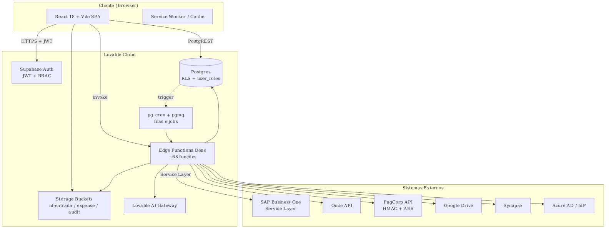
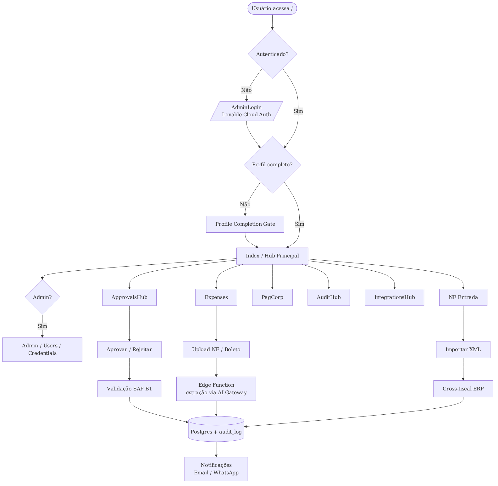
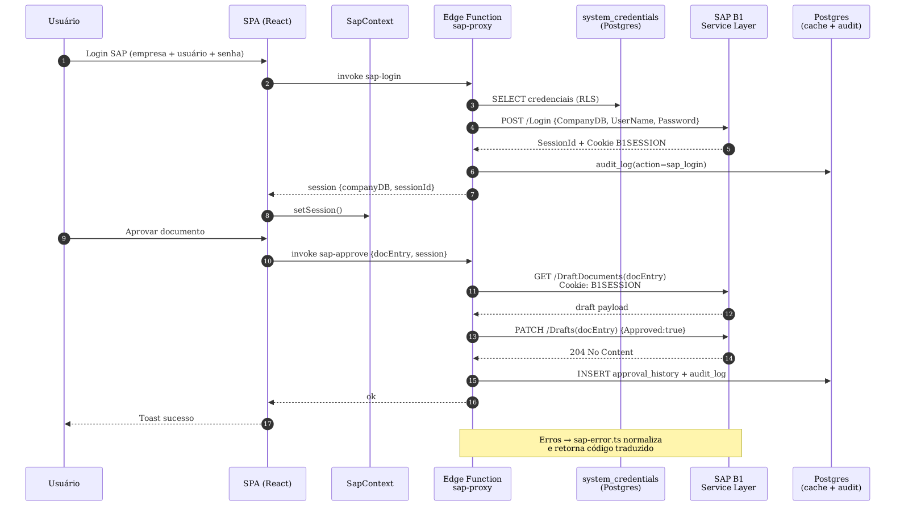
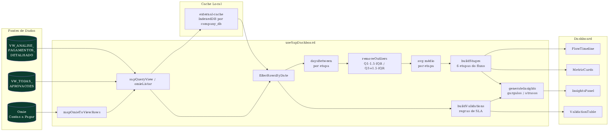

# Handover Técnico — ERP Flow

**Projeto:** ERP Flow (Cactus Corporation) · **Domínios:** `erp-flow.cactuscorporation.com`, `erp-smart-stream.lovable.app`
**Data:** 14/07/2026 · **Público-alvo:** desenvolvedores / engenharia · **Classificação:** interno
**Objetivo:** documentação técnica módulo por módulo e função por função para handover de desenvolvimento.

---

## Sumário

1. [Visão geral e stack](#1-visão-geral-e-stack)
2. [Estrutura do repositório](#2-estrutura-do-repositório)
3. [Ambiente, variáveis e segredos](#3-ambiente-variáveis-e-segredos)
4. [Front-end (`src/`)](#4-front-end-src)
   1. [Roteamento](#41-roteamento--srcapptsx)
   2. [Páginas](#42-páginas--srcpages)
   3. [Hooks](#43-hooks--srchooks)
   4. [Componentes-chave](#44-componentes-chave--srccomponents)
   5. [Utilitários (`src/lib/`)](#45-utilitários--srclib)
   6. [Contexts / providers](#46-contexts--providers)
   7. [Integrações (`src/integrations/`)](#47-integrações--srcintegrations)
   8. [Testes](#48-testes-existentes)
5. [Edge Functions (`supabase/functions/`)](#5-edge-functions-supabasefunctions)
   1. [Aprovações](#51-aprovações)
   2. [Despesas](#52-despesas-expenses)
   3. [Adiantamentos](#53-adiantamentos-advances)
   4. [NF Entrada](#54-nf-entrada)
   5. [PagCorp](#55-pagcorp)
   6. [SAP](#56-sap)
   7. [Auditoria](#57-auditoria)
   8. [Notificações / e-mail / WhatsApp](#58-notificações--email--whatsapp)
   9. [Integrações IA](#59-integrações-ia)
   10. [Cadastros](#510-cadastros)
   11. [Sincronização IDP](#511-sincronização-idp)
   12. [Backup](#512-backup)
   13. [`_shared/*`](#513-_shared-módulos-compartilhados)
6. [Camada de banco (Postgres / Supabase)](#6-camada-de-banco-postgres--supabase)
   1. [Extensões](#61-extensões-habilitadas)
   2. [Enums](#62-enums)
   3. [Tabelas por domínio](#63-tabelas-por-domínio)
   4. [Funções PL/pgSQL destaque](#64-funções-plpgsql-e-sql-destaque)
   5. [Triggers ativos](#65-triggers-ativos)
   6. [`pg_cron`](#66-jobs-pg_cron)
   7. [Filas `pgmq`](#67-filas-pgmq)
   8. [Buckets de Storage](#68-buckets-de-storage)
7. [Integrações externas](#7-integrações-externas)
8. [Automações, jobs e watchers](#8-automações-jobs-e-watchers)
9. [Segurança — resumo operacional](#9-segurança--resumo-operacional)
10. [Convenções de código e fluxo dev](#10-convenções-de-código-e-fluxo-dev)
11. [Runbooks curtos](#11-runbooks-curtos)
12. [Apêndices](#12-apêndices)

---

## 1. Visão geral e stack

Plataforma web corporativa que unifica **aprovações, despesas, adiantamentos, NF de entrada, cartões corporativos (PagCorp), auditoria fiscal e integração multi-empresa com SAP Business One e Omie**. Roda sobre Lovable Cloud (Supabase gerenciado).

**Stack**

| Camada | Tecnologia |
|---|---|
| Front-end | React 18 + Vite 5 + TypeScript 5 + Tailwind 3 + shadcn/Radix |
| Roteamento | react-router-dom 7 |
| Estado assíncrono | @tanstack/react-query 5 |
| UI de fluxo | @xyflow/react 12 |
| PDF / relatórios | jspdf 4.2 + jspdf-autotable, pptxgenjs 4 |
| Charts | recharts 3 |
| Backend (BaaS) | Lovable Cloud: Postgres 15, PostgREST, GoTrue, Storage, Realtime |
| Runtime serverless | Deno Deploy (Supabase Edge Functions) |
| Filas | pgmq + pg_cron |
| Auditoria | audit_trail hash-chain (pgcrypto) |
| Testes | Vitest + Testing Library, Playwright |
| Lint / typecheck | ESLint 9 + typescript-eslint, `tsgo` |
| Package manager | Bun (`bun.lock` texto) |

**Ordem-alto-nível**

```text
Browser SPA ─(HTTPS+JWT)─▶ Supabase API ─(RLS)─▶ Postgres
        │                        │                 │
        │                        ├──▶ Storage (privado, signed URLs)
        │                        └──▶ Realtime (notifications, chat)
        │
        └─(supabase.functions.invoke)─▶ Edge Functions (Deno)
                                            │
                            ┌──────────┬────┴─────┬─────────────┐
                            ▼          ▼          ▼             ▼
                          SAP B1     Omie      PagCorp      SMTP/WhatsApp/
                          Service    REST     (HMAC/AES)    Drive/AI Gateway
                          Layer
```

---

## 2. Estrutura do repositório

```text
/
├─ src/                        # front-end React
│  ├─ App.tsx                  # rotas + providers
│  ├─ pages/                   # ~50 páginas
│  ├─ hooks/                   # hooks de dados e UI
│  ├─ components/              # UI reutilizável + shadcn/ui
│  ├─ contexts/                # SapContext
│  ├─ lib/                     # utilitários e clients (sap, omie, pdf)
│  ├─ integrations/            # supabase/client.ts + types (auto-gen)
│  └─ test/                    # setup Vitest
├─ supabase/
│  ├─ functions/               # ~68 Edge Functions Deno + _shared/
│  ├─ migrations/              # 200+ arquivos SQL
│  └─ config.toml              # flags verify_jwt por função
├─ docs/                       # documentação técnica (este arquivo, external-approvals-api…)
├─ public/                     # assets estáticos
├─ index.html                  # meta, tracking
├─ package.json                # deps + overrides (dompurify)
├─ bun.lock
├─ tailwind.config.ts / vite.config.ts / tsconfig.json
└─ eslint.config.js
```

---

## 3. Ambiente, variáveis e segredos

### 3.1 Front-end (público)
- `VITE_SUPABASE_URL` — URL do projeto Cloud.
- `VITE_SUPABASE_PUBLISHABLE_KEY` — anon publishable key.
- `VITE_SUPABASE_PROJECT_ID` — id textual.
- `VITE_CONVEX_URL`, `VITE_CONVEX_DEPLOY_KEY` — legado; revisar aposentadoria.
- Arquivos auto-gerados (**não editar**): `src/integrations/supabase/client.ts`, `src/integrations/supabase/types.ts`, `.env`.

### 3.2 Edge Functions (privado)
Cofre de segredos gerenciado pelo Lovable Cloud. Nomes em uso:
`SUPABASE_URL`, `SUPABASE_ANON_KEY`, `SUPABASE_SERVICE_ROLE_KEY`, `SUPABASE_DB_URL`, `SUPABASE_PUBLISHABLE_KEY`, `SUPABASE_JWKS`,
`LOVABLE_API_KEY`, `LOVABLE_SEND_URL`,
`SAP_DEFAULT_BASE_URL`, `SAP_FALLBACK_ADMIN_USERNAME`, `SAP_FALLBACK_ADMIN_PASSWORD`, `SAP_MIDDLEWARE_SECRET`, `HANA_VIEWS_URL`,
`PAGCORP_API_BASE_URL`, `PAGCORP_ACCOUNT_ID`, `PAGCORP_CLIENT_KEY`, `PAGCORP_CLIENT_SECRET`, `PAGCORP_HMAC_KEY`, `PAGCORP_AES_KEY`, `PAGCORP_LOGIN_EMAIL`, `PAGCORP_LOGIN_PASSWORD`,
`EXTERNAL_APPROVALS_API_KEY`, `API_AUDIT_HISTORY_TOKEN`, `APPROVAL_HISTORY_WEBHOOK_URL`,
`SMTP_PASSWORD`, `GOOGLE_DRIVE_API_KEY`, `PUBLIC_APP_URL`, `COMPANY_NAME_MATCH_THRESHOLD`.

> Regra: nenhum segredo acima é referenciado pelo bundle front-end. Somente `VITE_SUPABASE_URL/PUBLISHABLE_KEY` são publicáveis.

### 3.3 Comandos usuais

```bash
bun install
bun run dev            # Vite em :8080
bun run build
bun run typecheck      # tsgo
bunx vitest run        # unit
bunx playwright test   # e2e
```

Deploy é feito automaticamente ao publicar via Lovable. Migrations SQL são aplicadas pela plataforma; Edge Functions são deployadas pelo diretório `supabase/functions/*`.

---

## 4. Front-end (`src/`)

### 4.1 Roteamento — `src/App.tsx`

Provider tree: `ThemeProvider` (next-themes, `defaultTheme="dark"`) → `QueryClientProvider` (TanStack Query) → `TooltipProvider` → `SapProvider` (`src/contexts/SapContext.tsx`) → `BrowserRouter`. Fora do Router: `TestCompanyBanner`, `DefaultPasswordWarning`, `GlobalAiChat`. Dentro: `StickyHeaderMeasure`, `MobileBottomNav`.

| Rota | Componente | Protegida? |
|---|---|---|
| `/` | `Index` | Sessão SAP/ERP requerida via `useSap`; `ProfileCompletionGate` desativado |
| `/backoffice/login` | `AdminLogin` | Não |
| `/backoffice` | `Admin` (`Backoffice`) | `AdminRoute` |
| `/backoffice/sap-users` | `SapUsersAdmin` | `AdminRoute` |
| `/backoffice/sap-users/replicate` | `SapUsersReplicate` | `AdminRoute` |
| `/backoffice/audit-trail` | `AuditTrail` | `AdminRoute` |
| `/backoffice/transfer-history` | `TransferApprovalsHistory` | `AdminRoute` |
| `/backoffice/sap-sync` | `SapStatusSync` | `AdminRoute` |
| `/backoffice/sap-sync/execucoes` | `SapSyncRuns` | `AdminRoute` |
| `/analytics` | `Analytics` | Gate `useSap`/`useModuleAccess` |
| `/compras` | `Expenses` | Gate interno |
| `/vendas` | `Sales` | Não |
| `/aprovacoes` | `ApprovalsHub` | Não |
| `/aprovacoes/regras` | `ApprovalRules` | Não |
| `/cartoes` → `/cartoes/transacoes` | redirect | — |
| `/cartoes/transacoes` | `PagCorp` | Não |
| `/cartoes/mapeamento` | `PagCorpMapping` | Não |
| `/cartoes/indedutiveis` | `PagCorpNondeductible` | Não |
| `/cartoes/historico` | `IntegrationHistory` | Não |
| `/auditoria` → `/auditoria/sap` | redirect | — |
| `/auditoria/sap/*` | `AuditHub` (tab=sap) | Não |
| `/auditoria/fiscal` | `AuditHub` (tab=fiscal) | Não |
| `/auditoria/cruzamento` | `AuditHub` (tab=cruzamento) | Não |
| `/auditoria/logs` | `AuditHub` (tab=logs) | Não |
| `/integracoes` → `/integracoes/automacoes` | redirect | — |
| `/integracoes/automacoes` | `IntegrationsHub` (tab=automations) | Não |
| `/integracoes/monitor` | `IntegrationsHub` (tab=monitor) | Não |
| `/integracoes/credenciais` | `IntegrationsHub` (tab=credentials) | Não |
| `/usuarios` → `/usuarios/lista` | redirect | — |
| `/usuarios/lista` | `UsersHub` (tab=list) | Não |
| `/usuarios/atividade` | `UsersHub` (tab=activity) | Não |
| `/usuarios/produtividade` | `UsersHub` (tab=productivity) | Não |
| `/usuarios/sincronizacao-idp` | `UsersHub` (tab=idp) | Não |
| `/usuarios/licencas` | `UsersHub` (tab=licenses) | Não |
| `/usuarios/importar-licencas` | `UsersHub` (tab=licenses-import) | Não |
| `/cadastros/fornecedores` | `Suppliers` | Não |
| `/cadastros/itens` | `Items` | Não |
| `/cadastros/intercompany` | `Intercompany` | Não |
| `/financeiro/adiantamentos` | `AdvancePayments` | Não |
| `/financeiro/reconciliacao` | `FinancialReview` | Não |
| `/financeiro/nf-entrada` | `NfEntrada` | Não |
| `/notificacoes` | `Notifications` | Não |
| `/perfil` | `Profile` | Não |
| `*` | `NotFound` | Não |

> Fora de `AdminRoute`, a proteção é feita **por página** via `useSap()` (sessão ERP) e `useModuleAccess(moduleKey)` (permissões por módulo).

### 4.2 Páginas — `src/pages/`

- **Index.tsx** — Home autenticada: exibe `SapLoginForm` sem sessão, senão `MainMenu`.
- **AdminLogin.tsx** — Login backoffice (Supabase Auth + OAuth Lovable).
- **Admin.tsx** — Console: gestão de `companies` e `system_credentials`.
- **AdvancePayments.tsx** — Adiantamentos (aprovar/rejeitar/retry/remove). Hook `useAdvancePayments`.
- **Analytics.tsx** — Dashboard (fluxo, pagamento, aprovações pendentes, chat IA). Hooks `useSapDashboard`, `usePaymentAnalysis`.
- **ApprovalHistory.tsx** — Histórico com filtros + PDF/CSV; `audit_log`, `expense_approval_log`, `expenses`.
- **ApprovalRules.tsx** — CRUD de `approval_rules` + níveis + simulador.
- **Approvals.tsx** / **ApprovalsHub.tsx** — Fila operacional e shell de abas com `useModuleAccess`.
- **AuditConsole.tsx** — Console de auditoria (runs/insights/divergências) via `useAuditConsole`.
- **AuditCrossFiscal.tsx** — Cruzamento fiscal (edge fn `audit-cross-fiscal-run`).
- **AuditHub.tsx** — Shell de abas de auditoria.
- **AuditLog.tsx** — Log genérico via `useAuditLog`.
- **AuditTrail.tsx** — Trilha imutável (backoffice).
- **Credentials.tsx** — Gestão de credenciais por ERP habilitado.
- **Expenses.tsx** — Central de despesas: fila, drafts, aprovação.
- **FinancialReview.tsx** — Reconciliação por empresa.
- **FiscalAudit.tsx** — Auditoria fiscal SAP.
- **IdpSync.tsx** — Sincronização IdP × usuários SAP.
- **IntegrationHistory.tsx** — Histórico de integração PagCorp.
- **IntegrationsHub.tsx** / **IntegrationsMonitor.tsx** — Automações, monitor e credenciais.
- **Intercompany.tsx** — Cadastro/gestão intercompany.
- **Items.tsx** — Cadastro de itens (variantes).
- **LicenseAnalysis.tsx** / **LicenseImport.tsx** — Licenças SAP (análise e importação).
- **NfEntrada.tsx** — NF de entrada MasterTax → SAP.
- **NotFound.tsx** — 404.
- **Notifications.tsx** — Central + preferências.
- **PagCorp.tsx** / **PagCorpMapping.tsx** / **PagCorpNondeductible.tsx** — Cartões corporativos.
- **Profile.tsx** — Perfil intercompany.
- **Sales.tsx** — Fluxo vendas.
- **SapStatusSync.tsx** / **SapSyncRuns.tsx** — Sync SAP status.
- **SapUsersAdmin.tsx** / **SapUsersReplicate.tsx** — Admin usuários SAP.
- **Suppliers.tsx** — Fornecedores.
- **Synapse.tsx** — Integrações Synapse (PO notify).
- **TransferApprovalsHistory.tsx** — Transferência de aprovações.
- **UserActivity.tsx** / **UserProductivity.tsx** / **Users.tsx** / **UsersHub.tsx** — Usuários.

### 4.3 Hooks — `src/hooks/`

Formato: `hook(args) → retorno` — tabelas / edge fns.

- **useAdvancePayments()** → `{ items, loading, error, refresh, approve, reject, retry, remove }` — `advance_payments`, `advance_payment_items`, `advance_payment_attachments`.
- **useApprovalHistory(...)** → `ApprovalHistoryRow[]` — `audit_log`, `expense_approval_log`, `expenses`.
- **useApprovalRules()** → CRUD + utilitários (`dedupeParallelApprovers`, `normalizeCriteria`, `OPERATOR_LABELS`, `FIELD_OPTIONS`) — `approval_rules`, `approval_rule_levels`. Teste unitário.
- **useApprovals()** → aprovações pendentes — `sap_cache`.
- **useApproverCostCenters(companyDB)** — `approver_cost_centers`.
- **useApproverSubstitutes()**, **useActiveOfficialsForMe()**, **useSubstituteGrantsForMe()**.
- **useAuditConsole.ts** — `useAuditRuns/Run/Divergences/Insights/Logs/Rules/Dashboard/Documents`, `useStartAuditRun`, `useUpdateAuditRule`, `useUploadAuditDocument`. Edge fns `audit-console-run`, `audit-console-analyze-doc`.
- **useAuditCrossFiscal(filters)** — edge fn `audit-cross-fiscal-run`.
- **useAuditLog(companyDb?)** — `audit_log`.
- **useAuth()** → `{ user, isAdmin, loading, signIn, ... }` — `user_roles`.
- **useCompanies(onlyActive?)** → `{ companies, getLabel, ... }` + `DEFAULT_TARGETS` — `companies`.
- **useCostCenterNames(codes?)** — mapa código → nome.
- **useCredentials()** — CRUD credenciais.
- **useDocumentDrafts(docType, companyDb)** — `document_drafts`.
- **useEnabledErpTypes()** — `enabled_erp_types`.
- **useExpenses(docType="purchase")** — `expenses`, `expense_items`, `expense_attachments`.
- **useFinancialReview(companyDb)** — reconciliação.
- **useIdpSync()** — `idp_user_mapping`.
- **useImportPagCorpSuppliers(...)** — matching de fornecedores de cartão.
- **useIntercompany()**, **useItems(companyDb?)**, **useLazyList<T>(...)**.
- **useLicenseAnalysis(periodDays)** — `license_pricing`, `user_licenses`.
- **useMergedSupplierOptions({...})** — opções mescladas — `companies`, `suppliers`.
- **useMyRequests()** — solicitações do usuário.
- **useNfEntrada()** — `nf_entrada_imports`, `nf_entrada_logs`; edge fns `mastertax-pull`, `nf-entrada-fetch-file`, `nf-entrada-rematch`, `nf-entrada-to-sap`.
- **useNondeductibleCards(companyDb?)** — util `resolveCardIdentifier`.
- **useNotifications()**, **useNotificationPreferences()** — const `NOTIFICATION_CATEGORIES`; `notifications`, `notification_preferences`.
- **usePagCorp()** — `pagcorp_integration_log`.
- **usePagCorpCardMapping(companyDb)**, **usePagcorpSettlementAccounts(companyDb?)** — edge fn `pagcorp-settlement-watcher`.
- **usePaymentAnalysis()** — `PaymentAnalysisData`.
- **usePermissions.ts** — `usePermissionGroups()`, `useUserAssignments()`, `useModuleAccess(moduleKey)`; constantes `MODULES`, `ALL_MODULES`, `CAPABILITIES`.
- **usePersistedState<T>(key, initial)** — localStorage.
- **useRelationsMapDerived.ts** — `useNfEntradaLinks`, `useContasPagarLinks`.
- **useSapCachedList({...})** — `sap_cache`.
- **useSapDashboard(dateFilter?, targets?)** — `SapDashboardData`.
- **useSapSubstitutes()**, **filterActiveNow(...)**.
- **useSapUsers()**, **useSapUsersAdmin()** — edge fn `sap-users-admin`.
- **useSuppliers(companyDb?)** — edge fn `supplier-sync`.
- **useSynapseGlobalSettings()**, **useSynapseIntegrations(companyDB?)** — `synapse_integrations`, `synapse_execution_log`.
- **useUserActivity()** — utils `getSourceLabel`, `isFailedLogin`, `formatDuration`, `getActionLabel`.
- **useUserPhones()** — `user_phones`.
- **useUserProductivity()** + `useProductivityFilters`, agregadores `aggregateByDepartment/User/DocType`.
- **useUserProfile()** — `user_phones`, `user_profiles`; edge fn `sap-user-profile-sync`.
- **use-mobile.tsx** — `useIsMobile()`.
- **use-toast.ts** — reducer/hook de toast (shadcn).

### 4.4 Componentes-chave — `src/components/`

**Estruturais**
- **Dashboard.tsx** — `Dashboard({ embedded? })`: métricas, upload, timeline de fluxo. Usa `useSapDashboard`, `useSap`.
- **MainMenu.tsx** — `MainMenu()`: cards de módulos navegando pelas rotas; usa `useCompanies`.
- **GlobalAiChat.tsx** — chat flutuante global. Chama edge fn `ai-assistant` via fetch direto (`${VITE_SUPABASE_URL}/functions/v1/ai-assistant`).
- **RowActionsMenu.tsx** — `RowActionsMenu({ actions, ... }: RowActionsMenuProps)`: dropdown genérico (tipos `RowAction`, `RowActionIcon`).
- **ExpenseEventHistory.tsx** — timeline de eventos/aprovações de despesa.
- **RelationsMap.tsx** / **RelationsMapFlow.tsx** — modal com o mapa de relações (compra → pagamento → SAP) via `@xyflow/react`.
- **AuditLogTable.tsx** — tabela filtrável de `AuditLogEntry`.
- **PermissionManager.tsx** — UI de grupos de permissão e atribuição a usuários SAP.
- **AdminRoute.tsx** — guarda: exige `useAuth().isAdmin`.
- **ProfileCompletionGate.tsx** — atualmente desativado em `Index.tsx`.
- **TestCompanyBanner**, **DefaultPasswordWarning**, **NotificationBell**, **MobileBottomNav**, **MobileMenuSheet**, **HubTabs**, **PageTitle**, **PeriodFilter**, **StickyHeaderMeasure**, **ThemeToggle**, **ThemeProvider** — chrome comum.

**Modais / dialogs**
- **BackofficeChangePasswordDialog**, **ChangePasswordDialog** (`{ open?, onOpenChange?, hideTrigger?, warningMessage? }`).
- **ConfirmDialog** (genérico), **ResponsiveDialog** (wrapper mobile/desktop).
- **CreateUserDialog** `{ onCreateUser, isLoading }`.
- **CreateAdvanceModal**, **CreateExpenseModal**, **EditExpenseModal** `{ expense, open, onClose, onSave, mode? }`.
- **EditNfEntradaDialog** `{ item, open, onOpenChange, onSaved }`.
- **EditPhoneDialog**, **NewFornecedorDialog**, **NewItemWizardDialog**.
- **PagCorpConsolidateDialog** `{ open, onClose, transactions, onConfirm }`, **PagCorpIntegrateDialog**, **PagCorpNondeductibleDialog**, **PagCorpPresentationDialog** `{ open, onClose, companyLabel, onGenerate }` (usa `lib/pagcorp-presentation.ts`).
- **ItemFormModal**, **SupplierFormModal** `{ open, onClose, onSaved, editing, prefill, source? }`.
- **SapValidationDialog** `{ open, onClose, pagcorpLogId, docEntry, docNum, expectedAmount, expectedCurrency }`.

**`src/components/audit-console/*`**
- **AuditDashboard** — painel KPIs.
- **AuditDivergencesTable** `{ runId, embedded? }` — divergências da run.
- **AuditDocumentsTab** — upload + `audit-console-analyze-doc`.
- **AuditInsightsList** — insights gerados por IA.
- **AuditLogsViewer** `{ runId? }` — logs técnicos.
- **AuditRulesTable** — regras.
- **AuditRunDetail** — composição das abas.
- **AuditRunsList** — lista de execuções.
- **NewAuditRunDialog** — dispara `audit-console-run`.
- **badges.tsx** — `SeverityBadge`, `RunStatusBadge`, `DIVERGENCE_TYPE_LABELS` (enums `audit_console_severity`/`audit_console_run_status`).

### 4.5 Utilitários — `src/lib/`

- **ai-file-cache.ts** — `hashFile`, `hashUrls`, `getCachedAi`/`setCachedAi`/`clearAiCache`, `withAiCache`.
- **ai-response-cache-persist.ts** — persistência do cache de IA por escopo.
- **approval-authz.ts** — `isPendingApproval`, `isDesignatedApprover`, `resolveDesignatedApprovers/Approver`, `canCallerApproveInternal`.
- **approvalSegments.ts** (+ teste) — `evaluateCriterion/Criteria`, `findMatchingRule`, `segmentDocByRules`, `isTrulySegmented`, `segmentsForApprover` — motor de segmentação.
- **attachment-validation.ts** — `validateAttachments`, `MAX_ATTACHMENT_SIZE_BYTES` (20MB), `ALLOWED_ATTACHMENT_ACCEPT/HINT`.
- **auth-fetch.ts** — `authFetch`, `publicFunctionFetch`, `sapFunctionFetch`.
- **cache-repository.ts** — `CacheRepository<T>`; instâncias `sapUsersCache`, `sapSuppliersCache`, `sapItemsCache`, `jumpCloudUsersCache`.
- **countries.ts** — `COUNTRIES`, `getCountry`, `isForeign`.
- **doc-deep-link.ts** — `buildDocLink`, `copyDocLink`, `readDocParam`, `setDocParam`.
- **erp-labels.ts** — `getErpShortLabel(erpType)`.
- **expense-dedupe.ts** (+ teste) — `hashFileContent`, `findExistingClaims`, `claimDocumentHashes`, `partitionDuplicates`, `hasInFlightGuardTripped`.
- **expense-queue-persist.ts** — persistência da fila de captura (IndexedDB/local).
- **external-cache.ts** — `readCache`/`writeCache`, `useExternalCache`, `DEFAULT_CACHE_TTL_MS` (6h).
- **invoke-fn.ts** — `invokeFn<T>` wrapper único.
- **notifications.ts** — `createNotification(params)`.
- **notify-fiscal-missing-attachment.ts** — `notifyFiscalMissingAttachment(payload)`.
- **omie-client.ts** — `omieCall`, `omieListarContasPagar`.
- **pagcorp-presentation.ts** — `generatePagCorpPresentation(input)`.
- **pending-purchase-files.ts** — `setPendingPurchaseFiles`, `consumePendingPurchaseFiles`, `peekPendingPurchaseFiles`.
- **promote-fornecedor.ts** — `syncFornecedorToSap`.
- **rateio.ts** — `isAllApprovalModel`, `getRateioInfo`, `shouldShowRateio`, `sumSelectedShare`.
- **report-pdf.ts** (+ teste) — `exportListReportPdf/Csv`, `exportDetailReportPdf`, `exportExpenseDetailPdf`, `buildQueueSummaryJson`, `exportQueueSummary*`, `exportLowConfidenceReview*`, `exportPurchaseFlowReportPdf`.
- **sap-client.ts** — `sapLogin/Logout`, `ensureSapAuthToken`, `sapQuery`, `sapAction`, `sapDownloadAttachment`, `sapQueryView`, `sapReadApprovalsCache`/`sapWriteApprovalsCache`, `sapQueryAll`, `clearClientCache`.
- **sap-error.ts** — `parseSapError(input)`.
- **sap-multi-password.ts** — `listSapTargetCompanies`, `changePasswordInCompanies`, `isSamePasswordError`.
- **sap-substitutes.ts** — `fetchSapSubstitutes`, `normalizeSapSubstitutes`, `unwrapSapPayload`, `invalidateSapSubstitutesCache` (view SAP `VW_AG_APROVADORES_SUBSTITUTOS`).
- **supplier-request-email.ts** — `requestSupplierRegistration(payload)`.
- **supplier-search.ts** — `normalizeText`, `onlyDigits`, `scoreMatch`.
- **system-definitions.ts** — constantes/labels.
- **utils.ts** — `cn(...)` (merge de classes Tailwind).

### 4.6 Contexts / providers

- **`src/contexts/SapContext.tsx`** — `SapProvider`, `useSap()`, `useErp()` (alias). Gerencia sessão ERP (`ErpSession`/`ErpType`: sap, omie, s4hana*, totvs*, netsuite), persistida em `sessionStorage` (`erp_session_v1`), expiração 30 min. Expõe `{ session, isLoading, error, login, logout }`. Usa `sapLogin/sapLogout/ensureSapAuthToken` de `lib/sap-client.ts`.
- **`src/components/ThemeProvider.tsx`** — wrapper fino de `next-themes` (`attribute="class"`, `defaultTheme="dark"`, `storageKey="erp-theme"`).

### 4.7 Integrações — `src/integrations/`

- **`supabase/client.ts`** — instancia `supabase` tipado por `Database` de `types.ts`; `localStorage`, `persistSession: true`, `autoRefreshToken: true`. **Auto-gerado**.
- **`supabase/types.ts`** — tipos de tabelas/enums/functions. **Auto-gerado**.
- **`lovable/index.ts`** — `lovable.auth.signInWithOAuth(provider, opts)` (google/apple/microsoft), sincroniza sessão com `supabase.auth.setSession`. **Auto-gerado**.

### 4.8 Testes existentes

- `src/hooks/useApprovalRules.test.ts` — unitários de `dedupeParallelApprovers`/`normalizeCriteria`.
- `src/lib/approval-delegation.e2e.test.ts` — e2e de delegação.
- `src/lib/approvalSegments.test.ts` — motor de segmentação.
- `src/lib/expense-dedupe.test.ts` — deduplicação.
- `src/lib/report-pdf.test.ts` — relatórios PDF/CSV.
- `src/test/example.test.ts` + `src/test/setup.ts` — boilerplate/config.

---

## 5. Edge Functions (`supabase/functions/`)

Convenções: cada função tem CORS (`OPTIONS`), a maioria valida sessão via `_shared/auth.ts` (JWT Lovable Cloud e/ou headers SAP). Em `supabase/config.toml`, funções com `verify_jwt = false` (autenticação própria no handler): `auth-email-hook`, `send-smtp-email`, `synapse-po-notify`, `external-approvals-api`, `fornecedor-save`, `cnpj-lookup`, `supplier-sync`, `item-save`, `expense-approval-action`, `expense-mutation`, `expense-attachment-storage`, `expense-backfill-due-date`, `overdue-reminders-dispatch`, `expense-sap-status-sync`, `backup-to-gdrive`, `expense-integration-retry`, `resend-missing-attachment-notifications`, `pagcorp-settlement-watcher`. `process-email-queue` tem `verify_jwt = true`.

Cron confirmado nas migrations SQL: `expense-integration-retry`, `expense-sap-status-sync`, `overdue-reminders-dispatch`, `process-email-queue`, `purge-expense-action-idempotency`, `prune-integration-data`, `archive-audit-trail-monthly`.

### 5.1 Aprovações

#### `expense-approval-action`
- Path: `supabase/functions/expense-approval-action/index.ts`.
- Executa a aprovação/rejeição interna de uma despesa via `service_role` (RLS bloqueia escrita direta).
- **POST**; env: `SAP_DEFAULT_BASE_URL`, `SUPABASE_SERVICE_ROLE_KEY`, `SUPABASE_URL`.
- Tabelas: `approval_rule_levels`, `approver_substitutes`, `expense_action_idempotency`, `expense_approval_log`, `expense_audit_log`, `expenses`, `system_credentials`.
- Externo: SAP B1 Service Layer.
- Acionada por: UI (Aprovações).
- Shared: `validateSapSession`, `requireUser`, `AuthError` (`auth.ts`); `pickApproverSkippingRequester`, `SELF_APPROVAL_FALLBACK` (`approval-skip.ts`).

#### `expense-delegate`
- Delega/revoga aprovação interna. POST. Tabelas: `audit_log`, `expenses`. Shared: `requireAdminOrSapAdmin`, `authErrorResponse`.

#### `transfer-approvals`
- Reatribui aprovações pendentes em massa. Tabelas: `audit_log`, `expense_approval_log`, `expenses`, `notifications`. Shared: `requireAdmin`.

#### `external-approvals-api`
- API REST para sistema externo aprovar SAP B1 via `X-API-Key`.
- Env: `EXTERNAL_APPROVALS_API_KEY`, `SUPABASE_SERVICE_ROLE_KEY`, `SUPABASE_URL`. Tabelas: `companies`, `system_credentials`. Circuit breaker por `external_api_allowlist`.

#### `approval-history-sync`
- Sincroniza histórico e dispara webhook n8n (`APPROVAL_HISTORY_WEBHOOK_URL`).
- Tabelas: `approval_history`, `approval_history_sync_state`, `audit_log`, `companies`. Shared: `watcher-lock` (execução periódica).

### 5.2 Despesas (Expenses)

#### `expense-mutation`
- Gateway de escrita das despesas internas (criar, atualizar, submeter, cancelar, anexos, log).
- POST. Tabelas: `approval_rule_levels`, `approval_rules`, `expense_approval_log`, `expense_attachments`, `expense_items`, `expenses`.
- Shared: `validateSapSession`, `requireUser`, `AuthError`; `pickApproverSkippingRequester`, `SELF_APPROVAL_FALLBACK`.

#### `expense-attachment-storage`
- Gateway para bucket `expense-attachments` (upload, signed URL, remoção). POST. Tabelas: `advance_payments`, `expenses`. Shared: `validateSapSession`, `requireUser`.

#### `expense-backfill-due-date`
- Backfill de `due_date` reprocessando anexos com IA.
- POST `{ action:"one", expense_id }`. Env: `LOVABLE_API_KEY`. Tabelas: `expense_attachments`, `expenses`. Externo: Lovable AI Gateway.

#### `expense-integration-retry`
- Cron (pg_cron) — retentativa de integração SAP para despesas aprovadas, alerta WhatsApp para admin.
- Tabelas: `expense_audit_log`, `expenses`, `user_phones`. Externo: WhatsApp sender. Shared: `getIntegrationPause`, `pauseResponse`, `isTestCompanyDb`.

#### `expense-sap-status-sync`
- Cron — sincroniza status do PO no SAP para despesas com `sap_doc_entry`.
- Tabelas: `expense_sap_sync_runs`, `expenses`, `system_credentials`. Shared: `watcher-lock`.

#### `expense-to-sap`
- Lança despesa aprovada como PO no SAP B1. POST `{ expense_id }`.
- Tabelas: `expense_approval_log`, `expense_attachments`, `expense_items`, `expenses`, `pagcorp_integration_log`, `suppliers`, `system_credentials`. Externo: WhatsApp, SAP B1. Shared: `requireUserOrSapSession`, `tryAcquireIntegrationLock`, `releaseIntegrationLock`, `getIntegrationPause`.

#### `resend-missing-attachment-notifications`
- Backfill — reenvia e-mails de despesas integradas sem anexo. POST. Tabelas: `expense_attachments`, `expenses`.

### 5.3 Adiantamentos (Advances)

#### `advance-to-sap`
- Integra adiantamento como Down Payment Invoice no SAP. POST `{ advance_id }`.
- Tabelas: `advance_payment_attachments`, `advance_payment_items`, `advance_payments`, `system_credentials`. Externo: SAP B1. Shared: `requireUserOrSapSession`, `tryAcquireIntegrationLock`, `getIntegrationPause`.

#### `financial-review`
- Reconciliação financeira (AR + AP não conciliados) contra SAP; ações de vincular/reconciliar/cancelar. Tabelas: `system_credentials`. Shared: `requireUserOrSapSession`.

### 5.4 NF Entrada

#### `mastertax-pull`
- Busca NFs de serviço na Master Tax; upsert idempotente. POST.
- Tabelas: `enabled_erp_types`, `nf_entrada_imports`, `nf_entrada_logs`, `nf_entrada_settings`, `system_credentials`. Externo: `api.mastertax.app`. Shared: `logIntegrationCall`.

#### `mastertax-test`
- Testa credencial Master Tax. Shared: `requireAdminOrSapAdmin`.

#### `nf-entrada-fetch-file`
- Baixa XML/PDF (DANFSE) da Master Tax → bucket `nf-entrada-files` → signed URL. Usa `fflate`.

#### `nf-entrada-rematch`
- Reexecuta matching de uma NF contra POs/Esboços no SAP. Tabelas: `nf_entrada_imports`, `nf_entrada_logs`, `system_credentials`.

#### `nf-entrada-rematch-daily`
- Cron — invoca `nf-entrada-rematch` para todas as NFs sem PO. Shared: `watcher-lock`.

#### `nf-entrada-sap-watcher`
- Polling: para NFs `awaiting_sap`, consulta Draft do PO no SAP; se aprovado cria Draft de NF de Entrada; se rejeitado marca `sap_rejected`. Shared: `watcher-lock`, `linkNfToAp`.

#### `nf-entrada-to-sap`
- Quando NF é aprovada, cria Draft de PO (ObjectCode 22) no SAP. Shared: `getIntegrationPause`.

#### `sap-nf-entrada-sync`
- Cron — sincroniza `sap_nf_entrada_cache` incrementalmente por `UpdateDate`. Shared: `watcher-lock`, `sapFetch`.

### 5.5 PagCorp

#### `pagcorp-proxy`
- Proxy central para API PagCorp (HMAC). Env: credenciais em `system_credentials`. Shared: `requireUserOrSapSession`, `logIntegrationCall`.

#### `pagcorp-card-mapping`
- CRUD do mapeamento de cartões. Tabelas: `pagcorp_card_mapping`, `pagcorp_cards`.

#### `pagcorp-relations-resolver`
- Resolve PC ↔ NF ↔ Pagamento a partir dos caches SAP. Tabelas: `pagcorp_document_relations`, `pagcorp_integration_log`, `sap_nf_entrada_cache`, `sap_purchase_order_cache`, `sap_vendor_payment_cache`, `system_credentials`.

#### `pagcorp-settlement-watcher`
- Watcher — quando PO fechado pela NF, emite VendorPayment que baixa a fatura. PTAX via `olinda.bcb.gov.br`. Shared: `watcher-lock`, `linkNfToAp`.

#### `pagcorp-to-sap`
- Fluxo alternativo: cria PO + AP Invoice + Outgoing Payment em sequência sem passar por aprovação interna. Tabelas: `pagcorp_account_mapping`, `pagcorp_card_mapping`, `pagcorp_integration_log`, `pagcorp_item_mapping`, `system_credentials`.

### 5.6 SAP

#### `sap-b1-proxy`
- Proxy central Service Layer (login/consulta) + cache memória + `sap_cache`; ponte para HANA views.
- Env: `HANA_VIEWS_URL`, `SAP_DEFAULT_BASE_URL`, `SAP_MIDDLEWARE_SECRET`. Shared: `generateDynamicToken`.

#### `sap-cancel-purchase-order`
- Cancela POs no SAP. POST `{ companyDb, docEntries[], reason? }`.

#### `sap-change-password`
- Troca senha em lote em várias empresas, usando fallback admin. Env: `SAP_FALLBACK_*`.

#### `sap-po-cache-sync`
- Cron — `PurchaseOrders` → `sap_purchase_order_cache`. Shared: `watcher-lock`, `sapFetch`.

#### `sap-sl-cache-refresh`
- Refresh do cache genérico `sap_cache`.

#### `sap-user-profile-sync`
- Coleta dados SAP do usuário em todas empresas ativas.

#### `sap-users-admin`
- Administração de usuários SAP. Shared: `requireAdmin`.

#### `sap-vendor-payment-cache-sync`
- Cron — `VendorPayments` → `sap_vendor_payment_cache`; grava `PaymentInvoices` para cruzar Pagamento ↔ NF.

#### `intercompany`
- Lê/cria Plano de Contas e Profit Centers em todas empresas SAP ativas. Shared: `requireAdminOrSapAdmin`.

### 5.7 Auditoria

#### `audit-console-run`
- Motor do Audit Console — cria run, busca dados SAP via `sapFetch`, aplica regras, gera divergências e resumo executivo com IA.
- Env: `LOVABLE_API_KEY`, `SUPABASE_ANON_KEY`, `SUPABASE_SERVICE_ROLE_KEY`. Tabelas: `audit_console_divergences`, `audit_console_insights`, `audit_console_logs`, `audit_console_rules`, `audit_console_runs`, `system_credentials`.

#### `audit-console-analyze-doc`
- Fase 4 — analisa NF/contrato via IA e confronta com dados SAP da run. Tabelas: `audit_console_divergences`, `audit_console_documents`.

#### `audit-cross-fiscal-run`
- Motor de cruzamento Master Tax × ERP (agnóstico). POST `{ empresa_id, periodo_inicio, periodo_fim }`.
- Tabelas: `auditoria_cruzamento_config`, `auditoria_cruzamento_fiscal`, `companies`, `nf_entrada_imports`. Usa `erp-adapters/`, `fiscal-match.ts`.

### 5.8 Notificações / e-mail / WhatsApp

#### `send-smtp-email`
- Envio SMTP genérico (Gmail via `denomailer`); limite anexo ~25MB base64.

#### `process-email-queue`
- Cron — processa fila `email_send_state`/`email_send_log` (rate-limit 429). Env: `LOVABLE_SEND_URL`, `LOVABLE_API_KEY`.

#### `auth-email-hook`
- Webhook Supabase Auth: renderiza templates React (`_shared/email-templates/*`) para signup/invite/magic-link/recovery/email-change/reauthentication.

#### `overdue-reminders-dispatch`
- Cron `*/5 * * * *` — lembretes WhatsApp para documentos vencidos `pendente_aprovacao`. Tabelas: `expenses`, `overdue_reminder_log`, `overdue_reminder_settings`, `user_phones`.

#### `whatsapp-approval-digest`
- Digest periódico de aprovações pendentes. Shared: `generateDynamicToken`, `watcher-lock`.

#### `whatsapp-approval-watcher`
- Detecta novas solicitações e envia alerta imediato (evento a evento).

#### `whatsapp-login-watcher`
- Monitora logins SAP e envia alertas.

#### `synapse-po-notify`
- Notifica marcos de PO: `approved`, `grpo`, `ap_invoice`, `ap_paid`. Tabelas: `po_notification_sent`, `synapse_execution_log`, `synapse_global_settings`, `synapse_integrations`, `system_credentials`.

#### `license-idle-watcher`
- Detecta licenças PRO/CRM sem login >15 dias, alerta semanal WhatsApp+e-mail.

### 5.9 Integrações IA

#### `ai-assistant`
- Chat conversacional com tools que consultam despesas, fornecedores, regras, auditoria, licenças, notificações. Tabelas: `ai_chat_messages`, `ai_chat_threads`, `approval_rule_levels`, `approval_rules`, `audit_log`, `companies`, `expenses`, `license_idle_alerts`, `notifications`, `pagcorp_integration_log`, `suppliers`, `user_licenses`.

#### `report-ai-chat`
- Chat focado em relatórios pré-carregados no front. Env: `LOVABLE_API_KEY`.

#### `supplier-ai-extract`
- Extração estruturada de fornecedor de documentos/contratos.

#### `process-expense-doc`
- Extrai dados de comprovantes (imagem/PDF) via IA; aliases estáticos como fallback. Env: `COMPANY_NAME_MATCH_THRESHOLD`.

### 5.10 Cadastros

#### `fornecedor-save`
- Upsert de fornecedor. Tabelas: `fornecedores`. `verify_jwt=false`.

#### `cnpj-lookup`
- Consulta `publica.cnpj.ws/cnpj/` e enriquece `fornecedores`.

#### `supplier-sync`
- Sincroniza `suppliers` (leve, 63 linhas).

#### `item-save`
- Cria/atualiza `item_base` + `item_variante`.

#### `user-profile-save`
- Salva `user_profiles` + `user_phones`.

#### `admin-users`
- Admin de `user_roles` (GET/POST/DELETE).

#### `credentials`
- CRUD de `system_credentials` — GET (metadados; chaves só para admin), POST, DELETE. Shared: `requireAdminOrSapAdmin`.

#### `license-analysis`
- Analisa uso/custo de licenças. Tabelas: `license_pricing`, `sap_cache`, `user_licenses`.

#### `omie-proxy`
- Proxy Omie (`app.omie.com.br/api/v1/...`). Shared: `logIntegrationCall`.

### 5.11 Sincronização IDP

#### `idp-mapping`
- CRUD de `idp_user_mapping`. Shared: `requireAdmin`.

#### `jumpcloud-proxy`
- Proxy JumpCloud (`systemusers`). Shared: `requireAdmin`.

#### `synapse-jc-sync`
- Sincroniza Synapse ↔ JumpCloud. Tabelas: `idp_user_mapping`, `synapse_execution_log`, `synapse_integrations`, `system_credentials`.

#### `synapse-pagcorp-sync`
- Sync Synapse ↔ PagCorp (com apoio IA). Tabelas: `audit_log`, `pagcorp_account_mapping`, `pagcorp_integration_log`, `pagcorp_item_mapping`, `synapse_execution_log`, `synapse_integrations`, `system_credentials`.

### 5.12 Backup

#### `backup-to-gdrive`
- Cron 6h — backup Approvals/POs/anexos para Google Drive via `connector-gateway.lovable.dev/google_drive`. Retenção 90 dias. Env: `GOOGLE_DRIVE_API_KEY`, `LOVABLE_API_KEY`. Shared: `watcher-lock`.

### 5.13 `_shared/` — módulos compartilhados

- **`auth.ts`** — `AuthError`, `requireUser`, `requireAdmin`, `requireAdminOrSapAdmin`, `requireAdminOrSapSession`, `requireAdminOrSapSessionHeaders`, `validateSapSession`, `requireUserOrSapSession`, `requireUserOrSapSessionHeaders`, `authErrorResponse`.
- **`approval-skip.ts`** — `ApprovalLevel`, `ResolvedApprover`, `SELF_APPROVAL_FALLBACK`, `requesterMatchesApprover`, `pickApproverSkippingRequester`.
- **`fiscal-match.ts`** — `MatchTolerance`, `DEFAULT_TOLERANCE`, `normalizeCnpj`, `cnpjRoot`, `cnpjEquals`, `daysBetween`, `valorDentroTolerancia`, `dataDentroJanela`, `matchScore`.
- **`integration-log.ts`** — `IntegrationLogEntry`, `logIntegrationCall`.
- **`integration-pause.ts`** — kill-switch: `getIntegrationPause`, `pauseResponse`.
- **`link-nf-ap.ts`** — `linkNfToAp` (vincula NF a AP evitando duplicidade).
- **`sap-fetch.ts`** — `sapFetch` + `tryAcquireIntegrationLock`, `releaseIntegrationLock`.
- **`sap-middleware-token.ts`** — `generateDynamicToken`, `dynamicTokenHeader` (HMAC para middleware SAP/n8n/HANA).
- **`watcher-lock.ts`** — `tryWatcherLock`, `releaseWatcherLock`, `isTestCompanyDb`.
- **`erp-adapters/`** — `ERP_ADAPTERS`, `getAdapter(erpType)`, tipos `ErpAdapter`, `ContaPagaERP`, `AdapterContext`; implementações `OmieAdapter`, `SapB1Adapter`.
- **`email-templates/*.tsx`** — `SignupEmail`, `InviteEmail`, `MagicLinkEmail`, `RecoveryEmail`, `EmailChangeEmail`, `ReauthenticationEmail` (renderizados server-side pelo `auth-email-hook`).

---

## 6. Camada de banco (Postgres / Supabase)

Fonte: 204 arquivos em `supabase/migrations/*.sql` + `supabase/config.toml`. Última migration que altera cada objeto prevalece.

### 6.1 Extensões habilitadas

| Extensão | Schema | Uso |
|---|---|---|
| `pgcrypto` | public/extensions | `gen_random_uuid()`, `digest()` (SHA-256 do audit trail) |
| `pg_net` | extensions | `net.http_post` usado por `pg_cron` para chamar Edge Functions |
| `pg_cron` | — | agendamento de jobs |
| `supabase_vault` | — | segredos usados pelos jobs de fila de e-mail |
| `pgmq` | pgmq | filas (auth_emails, transactional_emails + DLQs) |
| `pg_trgm` | public | busca fuzzy (fornecedores/itens) |

### 6.2 Enums

| Tipo | Valores | Onde é usado |
|---|---|---|
| `public.expense_status` | status de despesa | `expenses.status` |
| `public.app_role` | `admin`, `user` | `user_roles.role`, base de `has_role()` |
| `public.nf_entrada_status` | status de importação | `nf_entrada_imports.status` |
| `public.audit_console_severity` | `low, medium, high, critical` | `audit_console_divergences`, `audit_console_insights` |
| `public.audit_console_run_status` | `pending, running, completed, failed` | `audit_console_runs.status` |
| `public.audit_console_divergence_type` | 15 valores (missing_order, missing_grpo, fraud_flag, ...) | `audit_console_divergences.type` |
| `public.item_tipo` | `produto`, `servico` | `item_base.tipo` |
| `public.fornecedor_tipo_pessoa` | `pj`, `pf` | `fornecedores.tipo_pessoa` |

### 6.3 Tabelas por domínio

RLS habilitado na maioria; policies mostradas são as vigentes. Muitas tabelas de integração/cache são geridas via `service_role` (Edge Functions) com leitura liberada a `authenticated`/admin.

**6.3.1 Identidade, papéis, permissões**
- `user_roles` — papel de cada usuário; UNIQUE `(user_id, role)`. Policy `Admins can manage user_roles` (via `has_role`).
- `user_profiles` — perfil por (`company_db`, `user_code`). Policies admin ALL + authenticated read/insert/update.
- `user_phones` — telefones para WhatsApp. 8 policies (leitura ampla, escrita restrita).
- `user_licenses` — licenças SAP; triggers `trg_user_licenses_updated_at`, `trg_sync_user_license`.
- `license_pricing`, `license_idle_alerts` — precificação e alertas.
- `permission_groups`, `permission_group_modules` — grupos e módulos (view/create/edit/delete).
- `user_group_assignments` — vínculo `sap_email` ↔ grupo (opcional `company_db`).
- `idp_user_mapping` — identidade externa ↔ interna.
- `system_credentials` — credenciais externas por `company_db`; trigger de cascata ao apagar `companies`.
- `companies` — empresas/bancos SAP; trigger `trg_companies_auto_flag_test` marca `is_test` para nome/DB `TST*`.
- `enabled_erp_types` — ERPs habilitados.

**6.3.2 Despesas / aprovação**
- `expenses` — cabeçalho (38 col). Escrita direta por `anon`/`authenticated` **revogada**; mutações via `expense-mutation`/`expense-approval-action`. Trigger `update_expenses_updated_at`.
- `expense_items` — mesmo padrão.
- `expense_attachments` — anexos (bucket `expense-attachments`).
- `expense_approval_log` — decisões (approve/reject/submitted) com `action_role`.
- `expense_audit_log` — auditoria paralela.
- `expense_action_idempotency` — reserva idempotência (constraint garante `completed_at`+`status_code` juntos). RLS `service_role only`. Ver `purge_expense_action_idempotency`.
- `expense_sap_sync_runs` — execuções do sync.
- `approval_rules`, `approval_rule_levels` — regras e níveis (policies legadas para anon ainda ativas em algumas).
- `approval_history`, `approval_history_sync_state`.
- `approver_cost_centers`, `approver_substitutes` (com vigência).
- `overdue_reminder_settings`, `overdue_reminder_log`.
- `whatsapp_approval_alerts`, `whatsapp_login_alerts`, `po_notification_sent`.
- `notifications`, `notification_preferences`, `notification_send_runs` — trigger `trg_notifications_skip_test_companies` descarta inserts para `is_test`.

**6.3.3 Adiantamentos**
- `advance_payments`, `advance_payment_items` (FK CASCADE), `advance_payment_attachments` — policies `advances_owner_*`.

**6.3.4 Cadastros**
- `item_base` — tipo produto/serviço + NCM/código de serviço.
- `item_variante` — `codigo_completo` gerado (`P{ncm}.{seq}` / `S{codigo_servico}.{seq}`) via RPC `create_item_variante`/`preview_next_codigo`.
- `fornecedores` — cadastro pj/pf.
- `suppliers` — cadastro paralelo sincronizado.

**6.3.5 Cache SAP / integração**
- `sap_cache`, `sap_purchase_order_cache`, `sap_purchase_order_sync_state`, `sap_nf_entrada_cache`, `sap_nf_entrada_sync_state`, `sap_vendor_payment_cache`, `sap_vendor_payment_sync_state`.
- `nf_entrada_imports`, `nf_entrada_logs`, `nf_entrada_settings`, `nf_entrada_contas_pagar`.
- `external_api_allowlist` — allowlist + circuit breaker (`failed_attempts`, `locked_until`); funções `check_external_api_access`, `register_external_api_failure/success`.
- `watcher_runs` — locks de watchers/jobs.
- `integration_log`, `pagcorp_integration_log`, `synapse_execution_log`.
- `integration_pause` — kill-switch manual.
- `submitted_document_hashes` — dedupe por usuário.

**6.3.6 PagCorp**
- `pagcorp_cards`, `pagcorp_card_mapping`, `pagcorp_account_mapping`, `pagcorp_item_mapping`, `pagcorp_document_relations`, `pagcorp_supplier_links`, `pagcorp_settlement_accounts`, `pagcorp_nondeductible_cards`, `pagcorp_nondeductible_expenses`.

**6.3.7 Synapse**
- `synapse_integrations`, `synapse_global_settings`, `synapse_execution_log`.

**6.3.8 Auditoria fiscal / console**
- `auditoria_cruzamento_config`, `auditoria_cruzamento_fiscal`.
- `audit_console_runs/documents/divergences/insights/logs/rules/workflow_runs/workflow_steps/accounts_payable/approval_requests/approval_decisions`. Padrão RLS `*_read` (via `can_access_audit_console`) + `*_admin*`.
- `audit_log` — log genérico admin.

**6.3.9 Trilha imutável (audit_trail — WORM)**
- `audit_trail` — append-only com `prev_hash`/`row_hash` (SHA-256). Alimentada por `audit_trigger()` via `enable_audit_on(_table)`. Triggers `audit_trail_guard_upd/del/trunc` (→ `_audit_guard()`) bloqueiam mutação. Policy `audit_trail_admin_read`.
- `audit_trail_archive` — destino do `archive_audit_trail`.
- View `public.audit_trail_all` (security_invoker) une ambas.

**6.3.10 Infra e-mail (pgmq)**
- `email_send_log`, `email_send_state`, `email_unsubscribe_tokens`, `suppressed_emails` — todas RLS restritas a `service_role`.

**6.3.11 IA / drafts**
- `ai_chat_threads`, `ai_chat_messages` — policy `Users manage own *`.
- `document_drafts` — CRUD restrito ao dono.

### 6.4 Funções PL/pgSQL e SQL destaque

| Função | Segurança | Propósito | Chamada por |
|---|---|---|---|
| `has_role(_user_id, _role)` | SQL, STABLE, SECURITY DEFINER | Verifica papel (evita recursão RLS) | Todas policies `Admins ...` |
| `can_access_audit_console(_company_db)` | SQL, STABLE, SECURITY DEFINER | Admin OU `user_group_assignments` para a empresa | Policies `*_read` do Console |
| `verify_audit_chain(_limit)` | plpgsql, SECURITY DEFINER | Recalcula hash e aponta o primeiro registro corrompido | Manual/admin |
| `archive_audit_trail(_keep_months=6, _batch_limit=50000)` | plpgsql, SECURITY DEFINER | Move em lote registros antigos para archive | Cron `archive-audit-trail-monthly` |
| `reassign_approval_rule_safe(_expense_id, _new_rule_id, _actor)` | plpgsql, SECURITY DEFINER | Reatribui regra preservando níveis já aprovados; grava logs | Só `service_role` |
| `create_item_variante(p_item_base_id, p_descricao)` | plpgsql, SECURITY DEFINER | Gera `codigo_completo` com retry em unique_violation | RPC `authenticated` |
| `preview_next_codigo(p_item_base_id)` | — | Pré-visualiza próximo código | RPC UI |
| `try_watcher_lock(_name, _ttl_minutes=10)` | plpgsql, SECURITY DEFINER | Upsert condicional em `watcher_runs` | `service_role`, início de jobs |
| `release_watcher_lock(_name, _status, _message)` | SQL, SECURITY DEFINER | Libera lock + status/mensagem | Fim de jobs |
| `register_external_api_failure/success` | plpgsql, SECURITY DEFINER | Circuit breaker (bloqueio 15 min após 3 falhas) | `external-approvals-api` |
| `get_sap_sync_health(_last_n=20)` | plpgsql, SECURITY DEFINER | Health do sync SAP (só admin) | RPC dashboard |
| `check_expense_action_idempotency_consistency()` | SQL, STABLE, SECURITY DEFINER | Métricas de consistência | monitoramento |
| `prune_old_integration_data()` | plpgsql, SECURITY DEFINER | Apaga logs >90 dias e alertas WhatsApp >60 dias | Cron `prune-integration-data` |
| `purge_expense_action_idempotency(_stale=15min, _completed=24h)` | plpgsql, SECURITY DEFINER | Remove reservas expiradas | Cron a cada 5 min |
| `notifications_skip_test_companies()` (trigger) | plpgsql, SECURITY DEFINER | `RETURN NULL` para empresas `is_test` | Trigger `trg_notifications_skip_test_companies` |
| `companies_auto_flag_test()` (trigger) | plpgsql, SECURITY DEFINER | Marca `is_test=true` para nome/DB `TST*` | Trigger `trg_companies_auto_flag_test` |
| `sync_user_license_across_companies()` (trigger) | plpgsql, SECURITY DEFINER | Propaga license_type/has_license entre empresas | Trigger `trg_sync_user_license` |
| `cascade_delete_company_credentials()` (trigger) | plpgsql, SECURITY DEFINER | Remove credenciais ao apagar company + log | Trigger `trg_cascade_delete_company_credentials` |
| `update_updated_at_column()` (trigger genérico) | plpgsql | Seta `updated_at = now()` | Dezenas de triggers |
| `audit_trigger()` (trigger genérico) | plpgsql, SECURITY DEFINER | Grava linha em `audit_trail` com hash encadeado | `enable_audit_on(_table)` |
| `_audit_guard()` (trigger interno) | plpgsql | Bloqueia UPDATE/DELETE/TRUNCATE em `audit_trail` | Triggers `audit_trail_guard_*` |
| `get_nf_entrada_cache_by_po(_company_db, _po_doc_entry)` | SQL, STABLE, SECURITY DEFINER | NFs vinculadas a um PO | RPC UI |
| `enqueue_email(queue_name, payload)` | SQL, SECURITY DEFINER | Wrapper `pgmq.send` | edge fns e-mail |
| `read_email_batch(queue_name, batch_size, vt)` | SQL, SECURITY DEFINER | Wrapper `pgmq.read` | `process-email-queue` |
| `delete_email(queue_name, message_id)` | SQL, SECURITY DEFINER | Wrapper `pgmq.delete` | `process-email-queue` |
| `move_to_dlq(source_queue, dlq_name, message_id, payload)` | plpgsql, SECURITY DEFINER | Envia à DLQ e remove da origem | `process-email-queue` |

> O disparo da fila de e-mail é o próprio job `pg_cron` `process-email-queue` (5s) chamando a Edge Function.

### 6.5 Triggers ativos

| Trigger | Tabela | Evento | Função |
|---|---|---|---|
| `audit_trail_guard_upd/del/trunc` | `audit_trail` | BEFORE UPDATE/DELETE/TRUNCATE | `_audit_guard()` |
| (dinâmico via `enable_audit_on`) `audit_trail_audit_trg` | quase todas de negócio | AFTER INSERT/UPDATE/DELETE | `audit_trigger()` |
| `trg_cascade_delete_company_credentials` | `companies` | BEFORE DELETE | `cascade_delete_company_credentials()` |
| `trg_companies_auto_flag_test` | `companies` | BEFORE INSERT/UPDATE OF display_name, company_db | `companies_auto_flag_test()` |
| `trg_notifications_skip_test_companies` | `notifications` | BEFORE INSERT | `notifications_skip_test_companies()` |
| `trg_sync_user_license` | `user_licenses` | AFTER INSERT/UPDATE OF license_type, has_license | `sync_user_license_across_companies()` |
| `trg_audit_cf_touch` / `trg_audit_cf_updated_at` | `auditoria_cruzamento_fiscal` | BEFORE UPDATE | `auditoria_cf_touch()` / `update_updated_at_column()` |
| `*_updated_at` diversos (`item_base`, `item_variante`, `fornecedores`, `document_drafts`, `ai_chat_threads`, `approver_*`, `pagcorp_*`, `advance_payments`, `approval_*`, `expenses`, `external_api_allowlist`, `nf_entrada_*`, `pagcorp_*`, `sap_*_cache/sync_state`, `suppliers`, `synapse_*`, `system_credentials`, `user_phones`, `user_profiles`, `user_licenses`, `audit_*`) | tabelas correspondentes | BEFORE UPDATE | `update_updated_at_column()` |

### 6.6 Jobs `pg_cron`

| Job | Schedule | Comando |
|---|---|---|
| `process-email-queue` | a cada 5s | `net.http_post` → `process-email-queue` |
| `expense-sap-status-sync-every-5min` | `*/5 * * * *` | `net.http_post` → `expense-sap-status-sync` |
| `expense-integration-retry-every-10min` | `*/10 * * * *` | `net.http_post` → `expense-integration-retry` |
| `overdue-reminders-dispatch` | `*/5 * * * *` | `net.http_post` → `overdue-reminders-dispatch` |
| `purge-expense-action-idempotency` | `*/5 * * * *` | `SELECT public.purge_expense_action_idempotency();` |
| `prune-integration-data` | `15 3 * * *` | `SELECT public.prune_old_integration_data();` |
| `archive-audit-trail-monthly` | `0 3 1 * *` | `SELECT public.archive_audit_trail(6, 50000);` |

Jobs recriados de forma idempotente (`cron.unschedule` + `cron.schedule`).

### 6.7 Filas `pgmq`

| Fila | DLQ | Uso |
|---|---|---|
| `auth_emails` | `auth_emails_dlq` | E-mails de autenticação (alta prioridade) — `auth-email-hook` |
| `transactional_emails` | `transactional_emails_dlq` | Notificações, lembretes, etc. |

Wrappers `SECURITY DEFINER`: `enqueue_email`, `read_email_batch`, `delete_email`, `move_to_dlq`. `EXECUTE` restrito a `service_role`.

### 6.8 Buckets de Storage

| Bucket | Público? | Observação |
|---|---|---|
| `expense-attachments` | Privado (foi alterado para privado em migration subsequente) | Anexos de despesas/adiantamentos; acesso via `expense-attachment-storage` |
| `nf-entrada-files` | Privado | Anexos XML/PDF de NF; acesso via `nf-entrada-fetch-file` |
| `audit-console-docs` | Privado | Anexos do Audit Console; acesso via `audit-console-analyze-doc` |

Policies detalhadas de `storage.objects` para esses buckets não estão inteiramente nas migrations (parte pode ter sido criada via dashboard). Confirmar antes de assumir "fail-closed".

---

## 7. Integrações externas

| Integração | Como conecta | Segredos | Notas |
|---|---|---|---|
| **SAP B1 Service Layer** | `sap-b1-proxy`, `sap-*-cache-sync`, `sap-nf-entrada-sync`, `sap-user-profile-sync`, `sap-cancel-purchase-order`, `sap-change-password`, `sap-users-admin` | `SAP_FALLBACK_ADMIN_USERNAME/PASSWORD`, `SAP_MIDDLEWARE_SECRET`, `SAP_DEFAULT_BASE_URL` | Multi-empresa por `company_db`; circuit breaker; multi-senha via `sap-multi-password` |
| **Omie** | `omie-proxy`, `src/lib/omie-client.ts` | credenciais em `system_credentials` | Bases Omie liberam todos os módulos (regra temporária) |
| **PagCorp** | `pagcorp-proxy` (HMAC+AES) | `PAGCORP_*` | Assinatura HMAC, campos cifrados |
| **Google Drive** | connector Lovable + `backup-to-gdrive` | `GOOGLE_DRIVE_API_KEY` | Backup periódico 6h |
| **SMTP (Gmail)** | `send-smtp-email`, filas `q_*_emails` | `SMTP_PASSWORD` | Templates auth + transacional; supressão e unsubscribe |
| **WhatsApp gateway** | `whatsapp-*`, `overdue-reminders-dispatch`, `expense-integration-retry`, `expense-to-sap` | URL/token **hardcoded** (`http://63.177.171.140/sender_wpp`) | Risco documentado; migrar para segredo |
| **Lovable AI Gateway** | `ai-assistant`, `report-ai-chat`, `supplier-ai-extract`, `audit-console-analyze-doc`, `license-analysis`, `expense-backfill-due-date`, `process-expense-doc`, `synapse-pagcorp-sync`, `backup-to-gdrive`, `auth-email-hook` | `LOVABLE_API_KEY` (managed) | Chat, análise de docs, extração |
| **IDP corporativo (JumpCloud)** | `jumpcloud-proxy`, `idp-mapping`, `synapse-jc-sync` | connector | Provisiona `idp_user_mapping` |
| **CNPJ lookup** | `cnpj-lookup` (`publica.cnpj.ws/cnpj/`) | — | Enriquecimento de fornecedor |
| **Master Tax** | `mastertax-pull`, `mastertax-test`, `nf-entrada-fetch-file` | credenciais em `system_credentials` | Ingestão NFs |
| **API externa de aprovações** | `external-approvals-api` documentada em `docs/external-approvals-api.md` | `EXTERNAL_APPROVALS_API_KEY` | API key + allowlist + circuit breaker |
| **n8n webhooks** | `sap-b1-proxy`, `whatsapp-*`, `license-idle-watcher`, `approval-history-sync` | `APPROVAL_HISTORY_WEBHOOK_URL` etc. | Orquestrações externas |
| **PTAX (BCB)** | `pagcorp-settlement-watcher` (`olinda.bcb.gov.br`) | — | Cotação de moeda |
| **Convex (legado)** | `VITE_CONVEX_URL`, `VITE_CONVEX_DEPLOY_KEY` | — | Revisar aposentadoria |

> Regra transversal: toda integração deve persistir e filtrar por `company_db`. Bases de teste (`TST%`) marcadas automaticamente e bloqueadas em `notifications`.

---

## 8. Automações, jobs e watchers

- **`pg_cron`** — ver §6.6.
- **Watcher lock** — `try_watcher_lock(_name, _ttl_minutes)` / `release_watcher_lock(_name, _status, _message)` na tabela `watcher_runs`.
- **Filas `pgmq`** — `auth_emails`/`transactional_emails` + DLQs (`move_to_dlq`); estado global em `email_send_state` (com `retry_after_until`).
- **Triggers-chave** — `audit_trigger`, `update_updated_at_column`, `cascade_delete_company_credentials`, `companies_auto_flag_test`, `notifications_skip_test_companies`, `sync_user_license_across_companies`.
- **Kill-switch** — `integration_pause` + `getIntegrationPause`/`pauseResponse` interrompem integrações sob demanda.

---

## 9. Segurança — resumo operacional

- **RLS habilitado** em todas as tabelas de negócio; nenhuma policy `USING(true)` identificada.
- **RBAC** via `has_role()` SECURITY DEFINER + grupos globais (`user_group_assignments`) + escopo por `company_db`.
- **Escrita de despesas** revogada para `anon`/`authenticated` — passa por `expense-mutation`/`expense-approval-action` com `service_role`.
- **Audit trail** WORM verificável (`verify_audit_chain`); arquivamento mensal (`archive_audit_trail`).
- **Idempotência** garantida (`expense_action_idempotency`).
- **Circuit breaker** em `external_api_allowlist` e locks em `watcher_runs` evitam concorrência.
- **Dependências** — sem high/critical no snapshot atual (overrides aplicados a `dompurify`, `react-router-dom`, `recharts`, `jspdf`).
- **Pontos de atenção**:
  - 3 warnings do scanner de storage (`audit-console-docs`, `expense-attachments`, `nf-entrada-files`) — revisar policies fail-closed.
  - HIBP, brute-force lockout e MFA não confirmados no auth manager.
  - CSP/HSTS dependem da camada de hosting; formalizar cabeçalhos no publish.
  - Token e URL do gateway WhatsApp hardcoded — mover para segredo.

Detalhamento no relatório `docs/relatorio-tecnico.md`.

---

## 10. Convenções de código e fluxo dev

- **Padrão de tokens** — todas as cores/gradientes/sombras são semânticas em `src/index.css` (HSL) + variantes shadcn. Nunca hardcode `text-white`, `bg-black`, `bg-[#...]`.
- **Editor de arquivos auto-gerados proibido**: `src/integrations/supabase/client.ts`, `types.ts`, `.env`, `supabase/config.toml` (mudanças de projeto).
- **Chamada de edge functions** — sempre via `lib/invoke-fn.ts` ou `lib/auth-fetch.ts` (nunca reescrever headers manualmente).
- **Novas tabelas em `public`** requerem, na mesma migration: `CREATE TABLE` → `GRANT` → `ENABLE ROW LEVEL SECURITY` → `CREATE POLICY`.
- **User roles** ficam em `user_roles` isolada (nunca em `user_profiles`); checagens via `has_role()`.
- **Testes**: rodar `bunx vitest run` antes de PR; testes-chave em `src/lib/*.test.ts` e `src/hooks/*.test.ts`.
- **Regra de visibilidade documental** — usuário vê o que criou/aprova; admin tem toggle "Ver todos" default ON em Approvals, ApprovalHistory e Expenses (memória de projeto).
- **Regra Omie** — bases Omie liberam todos os módulos, sem checagem de permissão (regra temporária de produto).
- **Company DB** — jamais misturar bases de teste e produção; trigger + filtro `notifications_skip_test_companies` protegem, mas é uma responsabilidade transversal em toda nova feature.

---

## 11. Runbooks curtos

**Nova regra de aprovação**
1. UI `/aprovacoes/regras` (`ApprovalRules.tsx`).
2. Persistência em `approval_rules` + `approval_rule_levels`.
3. Simulador (`RuleSimulator.tsx`) chama `lib/approvalSegments.ts`.
4. Após aprovação, `expense-mutation` seleciona a regra e cria níveis; `expense-approval-action` progride.

**NF de entrada falha no rematch**
1. Verificar `nf_entrada_logs` para a NF.
2. Rodar `nf-entrada-rematch` sob demanda (UI ou fetch).
3. Se o PO for encontrado depois, `nf-entrada-sap-watcher` fecha o loop.

**Auditoria imutável quebrada**
1. `SELECT * FROM verify_audit_chain(NULL);` retorna `first_broken_id`.
2. Inspecionar linhas próximas em `audit_trail`.
3. Corrigir dado subjacente com novo evento; **nunca editar `audit_trail`**.

**Reset de idempotência travada**
1. `SELECT check_expense_action_idempotency_consistency();`
2. `SELECT purge_expense_action_idempotency(15, 24);` roda no cron; para emergência, chamar manualmente.

**Fila SMTP travada**
1. Checar `email_send_state.retry_after_until`.
2. Verificar `pgmq.metrics('transactional_emails')`.
3. Se DLQ crescendo, inspecionar `email_send_log` (motivo).

**Adicionar edge function**
1. Criar `supabase/functions/<name>/index.ts` (padrão CORS + `_shared/auth.ts`).
2. Se público, adicionar `[functions."<name>"] verify_jwt = false` em `config.toml`.
3. Chamar via `invoke-fn.ts` no front.

---

## 12. Apêndices

**A. Comandos de investigação rápidos**
```bash
rg -l "supabase.functions.invoke\('([^']+)'" src            # quem chama cada edge function
rg -l "\.from\('([a-z_]+)'\)" src supabase/functions        # tabelas consumidas
ls supabase/functions | wc -l                               # total de edge functions
grep -c "CREATE TABLE" supabase/migrations/*.sql | sort -t: -k2 -n
```

**B. Docs correlatas**
- `docs/relatorio-tecnico.md` — Relatório técnico completo (arquitetura + segurança).
- `docs/relatorio-executivo.md` — Sumário executivo de 1 página.
- `docs/external-approvals-api.md` — Contrato da API pública de aprovações.
- `docs/quickbook-aprovacoes.html` — QuickBook (guia rápido operacional).

**C. Convenções de nomenclatura**
- Tabelas em snake_case, singular somente quando modelo é "único" (`integration_pause`); enum `snake_case`.
- Colunas monetárias em `numeric`; datas com `timestamptz`.
- FK sempre com `ON DELETE` explícito (CASCADE em `_items`/`_attachments`; RESTRICT/SET NULL em referências principais).
- Nome de edge fn segue verbo/objeto (`expense-to-sap`, `sap-po-cache-sync`).

**D. Padrão de log em edge fn**
```ts
import { logIntegrationCall } from "../_shared/integration-log.ts";
await logIntegrationCall(supabase, {
  company_db, integration: "sap_b1", operation: "purchase_orders/create",
  request_payload, response_status, response_payload, error_message
});
```

**E. Não faça**
- Não editar arquivos auto-gerados (§3.1/§4.7).
- Não usar `EXECUTE`/`SELECT` dinâmico com input do usuário sem `format('%I')`/parâmetros.
- Não expor chaves service_role no front (regra fail-closed).
- Não cortar `enable_audit_on` de tabela de negócio sem substituto de auditoria.
- Não introduzir política `USING (true)` — sempre escopar por `auth.uid()` ou `has_role()`.

---

**Fim do handover.** Para dúvidas, começar por §11 (runbooks) e depois §5 / §6 conforme o domínio afetado.

---

## Anexo A — Diagramas Técnicos

Fontes Mermaid em `docs/diagramas/*.mmd` e renderizações PNG em `docs/diagramas/*.png`.
Para regenerar: `bunx @mermaid-js/mermaid-cli -i <arquivo>.mmd -o <arquivo>.png -b white -w 1600`.

### A.1 Arquitetura Geral
Camadas Cliente / Lovable Cloud / Sistemas Externos, mostrando fluxos HTTPS+JWT, PostgREST, invocações de Edge Functions, storage buckets, filas `pg_cron`/`pgmq` e integrações externas (SAP B1, Omie, PagCorp, Google Drive, Synapse, IdP).



Fonte: [`docs/diagramas/01-arquitetura.mmd`](diagramas/01-arquitetura.mmd)

### A.2 Fluxo do Usuário
Jornada do usuário: autenticação → Profile Completion Gate → Hub principal → módulos operacionais (Approvals, Expenses, NF Entrada, PagCorp, Audit, Integrations) e ramo Admin. Cada trilha termina em persistência (`audit_log`) e disparo de notificações.



Fonte: [`docs/diagramas/02-fluxo-usuario.mmd`](diagramas/02-fluxo-usuario.mmd)

### A.3 Sequência — Validação SAP B1
Sequência detalhada do login e aprovação via Service Layer: SPA → `SapContext` → Edge Function `sap-proxy` → `system_credentials` (RLS) → SAP B1 Service Layer, com registro em `approval_history` e `audit_log`. Erros são normalizados por `sap-error.ts`.



Fonte: [`docs/diagramas/03-sequencia-sap-b1.mmd`](diagramas/03-sequencia-sap-b1.mmd)

### A.4 Geração do Resumo de Tempos (Dashboard)
Pipeline de `useSapDashboard`: coleta das views `VW_ANALISE_PAGAMENTOS_DETALHADO` e `VW_TODAS_APROVACOES` (ou Omie contas a pagar), cache local por `company_db`, cálculo por etapa (`daysBetween` → remoção de outliers IQR → média), montagem de `FlowStages`, validações de SLA e geração de `Insights`, terminando nos componentes do Dashboard.



Fonte: [`docs/diagramas/04-resumo-tempos.mmd`](diagramas/04-resumo-tempos.mmd)
